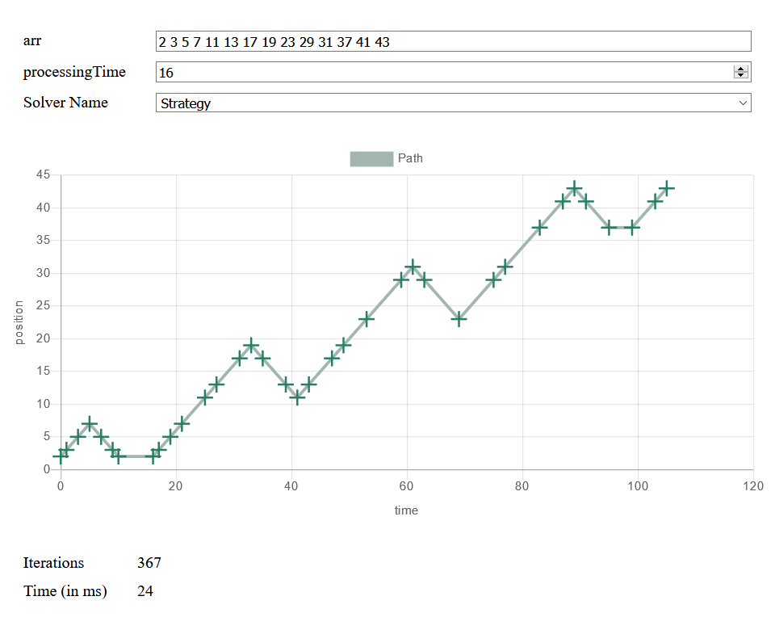

# Optimised Cost to Travel and Collect Units form Factories

Answer to a [question on StackOverflow](https://stackoverflow.com/questions/65634756/optimised-cost-to-travel-and-collect-units-form-factories) about optimization.

## Live Demo

[Link to Demo (or click the image)](https://josef37.github.io/factory-travel-optimization/)

[](https://josef37.github.io/factory-travel-optimization/)

## Problem statement

> There are 'n' factories, situated at arr[i]. The entry is at '0' and the exit id at 'exit-pos', where `0 < arr[i] < exit-pos`. The moving time form one place to another is the distance between the two.
> 
> Each factory takes 'processing' time (same for all) to process. You have to start from '0', exit from 'exit-pos' .
>
> Also you have to produce 'n' units, each factory can produce one unit only. Along the path you need to visit each factory and give the order to produce. Then it will take 'processing' time to produce it. you can wait that time for the unit to produce and move ahead. Or you can visit other factories to give them order. Latter you need to visit the factory again to pick the order.
> 
> Question: You need to tell the minimum time taken to produce 'n' units and collect them also. Your journey starts at '0' and ends at a 'end-pos'.
>
> Input:
> ```
> number of units required to produce = number of factories = n
> the location of factories in a array = arr
> the exit position =  exit-pos
> the processing time at each unit (it is same for each factory) = processing-time.
> ```

## Solution summary

Since `0 < arr[i] < exit-pos`, we always **start at the first** factory and **finish at the last**. It's trivial to add the remaining time.

The solution includes three different algorithms, which can be selected via a drop-down:

### 1. Dijkstra's algorithm

Explores all states and finds the minimum time to a final state:

* A state consists of the current **position** and the **state of all factories** (How long until product is done? Was it picked up?). 
* From each state either **wait** until production is finished, move **left** (to start) or **right** (to exit).
* Obviously uses [Dijkstra's algorithm](https://en.wikipedia.org/wiki/Dijkstra%27s_algorithm).

### 2. A* search algorithm

The [A* algorithm](https://en.wikipedia.org/wiki/A*_search_algorithm) is basically the same as Dijkstra's algorithm, but uses a heuristic to favor more promising nodes.

The **heuristic** used calculates the **minimum travel distance** without waiting. It computes the time to the leftmost unfinished factory and from there to the exit. 

The improvement is significant (even for small inputs).

### 3. Specialized A*

This version uses the same search as the previous, but restricts new states being explored:

It follows the strategy to **finish everything left of you, once you turn** from going right to going left. And waiting is only allowed at leftmost unfinished factory.

1. You can move left, only when there is a unfinished factory left of you. 
2. You can wait, only if you are at the leftmost unfinished factory.
3. You can move right, only if you're moving into untouched territory or everything not right of you is finished.
4. If you moved left last turn, continue moving only left as long as you can.
5. If you moved left last turn and cannot move left anymore, you have to only wait.

#### Why does this work?

1. Moving left does not make any sense otherwise. Just don't.
2. You'll have to come back to the leftmost unfinshed factory anyways. On the way back right you'll cross all factories to the right. So we choose to wait only at the very left, because waiting elsewhere can be transformed to waiting here.
3. Moving back right into touched territory won't be faster, since you have to come back to the very left (see 2.). Either go farther right initially, but only turn back right when you're done on your left.
4. You chose to go back when turning around. Other options are explored by moving farther right before turning.
5. Same as 4.

## Performance 

These are rough timings for this input:   
`n = 14`  
`arr = [2, 3, 5, 7, 11, 13, 17, 19, 23, 29, 31, 37, 41, 43]`  
`processingTime = 15`

| Algorithm |      Time |
| --------- | --------: |
| Dijkstra  | ~ 3000 ms |
| A*        |  ~ 100 ms |
| Strategy  |   ~ 10 ms |

## How to get to this solution

First I chose to visualize the solution and solve it by using Dijkstra's algorithm.

After inspecting the paths for various inputs, I noticed the pattern described in the "Strategy" solution: Going right, turning around and then completing this chunk of factories.

## Possible Improvements

One could take the strategy and chunk the factories array.

Each chunk `[a1, a2, ..., an]` takes `travelTime + waitTime = [3 * (an-a1)] + [min(0, processingTime - 2 * (an-a1))]` time to finish.  
And travelling between chunks `[a1, ..., an]` and `[b1, ..., bm]` takes `b1 - an` time.

Now one has to determine the chunks, which minimize the total time.

## Development

1. Run `npm install` to install all dependencies.
2. Run `npm start` to start a live development server with parcel-bundler.
3. Run `npm test` to run the tests with jest.
